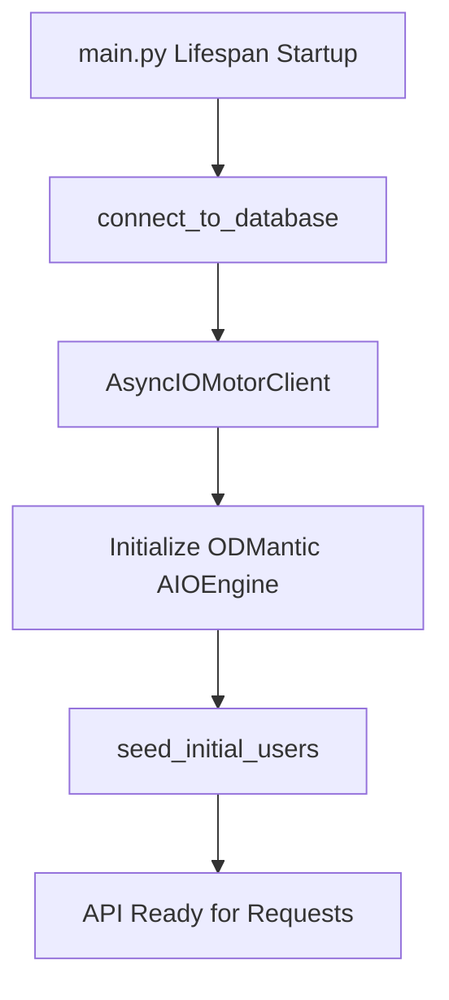
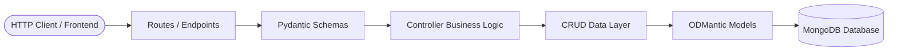
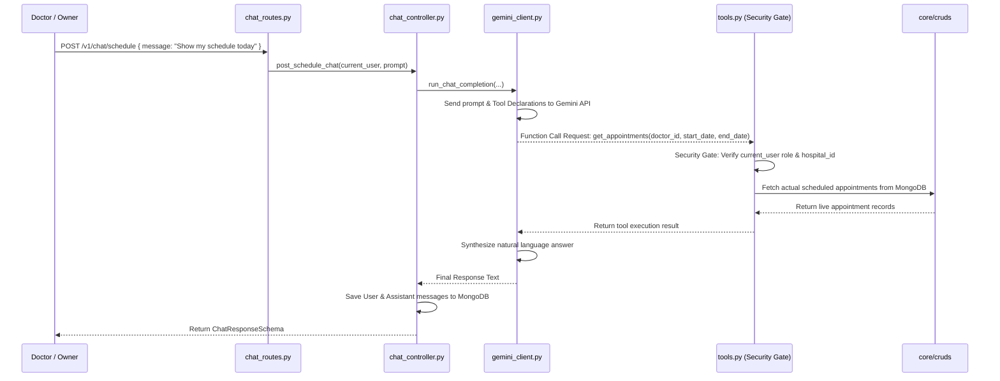

# 🏥 CityCare Clinic — Complete Architecture & Working Guide

This document provides an exhaustive, step-by-step technical explanation of the **CityCare Clinic** codebase. It covers the initial folder structure design, how core components are interconnected, the step-by-step construction of the **AI Schedule Assistant Chatbot**, and **why the chatbot follows the exact same layered architecture** as the core system.

---

## 📐 Table of Contents

1. [System Overview & Tech Stack](#1-system-overview--tech-stack)
2. [Step 1: Folder Structure & Directory Layout](#2-step-1-folder-structure--directory-layout)
3. [Step 2: Database Layer & Connection Flow](#3-step-2-database-layer--connection-flow)
4. [Step 3: Core Layered Architecture & Component Connectivity](#4-step-3-core-layered-architecture--component-connectivity)
5. [Step 4: Authentication & Multi-Tenant Security Scope](#5-step-4-authentication--multi-tenant-security-scope)
6. [Step 5: Building the AI Schedule-Assistant Chatbot](#6-step-5-building-the-ai-schedule-assistant-chatbot)
7. [Step 6: Why the Chatbot Follows the Same Architecture](#7-step-6-why-the-chatbot-follows-the-same-architecture)
8. [Step 7: End-to-End Data Flow & Verification](#8-step-7-end-to-end-data-flow--verification)

---

## 1. 🚀 System Overview & Tech Stack

CityCare Clinic is a **multi-tenant medical appointment management system** powered by an AI Schedule Assistant. The application enables patients to book appointments, doctors to manage daily rosters, hospital owners to manage clinic profiles, and super-admins to oversee the entire platform.

### Core Stack
- **Backend Framework**: [FastAPI](https://fastapi.tiangolo.com/) (Python 3.13)
- **Database & ODM**: MongoDB with [ODMantic](https://artofbrain.github.io/odmantic/) (Async MongoDB Object Document Mapper)
- **Data Validation & Schemas**: [Pydantic v2](https://docs.pydantic.dev/)
- **Authentication**: JWT (JSON Web Tokens) via `PyJWT` & `passlib` (Bcrypt password hashing)
- **AI / LLM Integration**: Google GenAI SDK (`google-genai`) using model `gemini-3.6-flash`
- **Frontend App**: React 18, TypeScript, TailwindCSS, Lucide Icons, Vite ([indigo-glow-app-main](file:///c:/Games/FOLDER%20PRACTICE/CITYCARE_CLINIC/indigo-glow-app-main))

---

## 2. 📂 Step 1: Folder Structure & Directory Layout

To ensure high maintainability, strict separation of concerns, and clean scalability, the project was organized into distinct functional directories:

```
CITYCARE_CLINIC/
├── main.py                          # Application entry point & FastAPI setup
├── .env                             # Environment variables (DB URL, Secrets, Gemini Keys)
├── requirements.txt                 # Dependencies manifest
│
├── core/                            # Core Business Domain Logic
│   ├── apis/
│   │   ├── api.py                   # Central API Router aggregation
│   │   ├── routes/                  # HTTP Route handlers per domain
│   │   │   ├── auth_routes.py       # Signup & Login endpoints
│   │   │   ├── appointment_routes.py# Patient appointment booking & cancellation
│   │   │   ├── doctor_routes.py     # Doctor roster & availability
│   │   │   ├── hospital_routes.py   # Hospital owner clinic management
│   │   │   └── admin_routes.py      # Super Admin management
│   │   └── schemas/                 # Pydantic request/response validation schemas
│   ├── controllers/                 # Business logic orchestrators
│   ├── cruds/                       # Low-level Database query functions
│   ├── models/                      # ODMantic MongoDB Document models
│   ├── database/                    # MongoDB connection & seed engine
│   └── constants.py                 # Enums (UserRole, AppointmentStatus, etc.)
│
├── common/                          # Cross-Cutting Shared Modules
│   ├── auth.py                      # JWT creation, verification, password hashing
│   ├── tenant_scope.py              # Multi-tenant context extraction
│   └── logger.py                    # Centralized application logging setup
│
├── chatbot/                         # AI Chatbot Sub-System (Phase 6)
│   ├── models/                      # ChatSession & ChatMessage ODMantic models
│   ├── schemas/                     # Chat request/response Pydantic schemas
│   ├── cruds/                       # Chat history MongoDB operations
│   ├── controllers/                 # Chat turn management & history formatting
│   ├── routes/                      # FastAPI HTTP endpoints (/v1/chat/schedule)
│   ├── gemini_client.py             # Google GenAI client & function calling loop
│   └── tools.py                     # Security-gated tool execution dispatcher
│
└── indigo-glow-app-main/            # React + TypeScript Modern Frontend
    └── src/
        ├── lib/api.ts               # Frontend API client layer
        └── components/chatbot/      # ScheduleChatBot floating UI drawer
```

---

## 3. 🔌 Step 2: Database Layer & Connection Flow

Database management is centralized in [`core/database/database.py`](file:///c:/Games/FOLDER%20PRACTICE/CITYCARE_CLINIC/core/database/database.py).

### How MongoDB is Connected
1. **ODMantic Engine Singleton**: An `AIOEngine` instance is created using `motor.motor_asyncio.AsyncIOMotorClient`.
2. **Lifespan Management**: [`main.py`](file:///c:/Games/FOLDER%20PRACTICE/CITYCARE_CLINIC/main.py#L57-L78) uses FastAPI's `@asynccontextmanager` lifespan handler:
   - **On Startup**: `connect_to_database()` connects to MongoDB and initializes collections/indexes. `seed_initial_users()` seeds default demo accounts.
   - **On Shutdown**: `close_database_connection()` gracefully closes all active database sockets.



---

## 4. 🔗 Step 3: Core Layered Architecture & Component Connectivity

The codebase strictly follows a 5-layer **Separation of Concerns (SoC)** architecture for every request.



### Layer Breakdown & Responsibilities

1. **Routes Layer (`core/apis/routes/`)**: Exposes REST endpoints, defines HTTP verbs (`GET`, `POST`, `DELETE`), handles authentication dependency injection (`Depends(get_current_user)`).
2. **Schemas Layer (`core/apis/schemas/`)**: Validates request payloads and structures outbound JSON responses using Pydantic.
3. **Controller Layer (`core/controllers/`)**: Implements application business logic, authorization checks, and orchestrates actions between multiple CRUDs.
4. **CRUD Layer (`core/cruds/`)**: Executes raw asynchronous database queries (`engine.find()`, `engine.save()`, `engine.delete()`).
5. **Model Layer (`core/models/`)**: Defines MongoDB document structures and index definitions using ODMantic `Model`.

---

## 5. 🛡️ Step 4: Authentication & Multi-Tenant Security Scope

Authentication and authorization are enforced at two levels:

1. **JWT Authentication (`common/auth.py`)**:
   - `create_access_token(data)` encodes `user_id`, `role`, `hospital_id`, and `email` into a signed JWT.
   - `get_current_user` decodes and validates incoming `Authorization: Bearer <token>` headers on protected endpoints.

2. **Role-Based Tenant Scoping (`common/tenant_scope.py`)**:
   - `get_hospital_scope` validates user roles (`patient`, `doctor`, `hospital_owner`, `super_admin`).
   - Ensures doctors and hospital owners can **only access data belonging to their own `hospital_id`**.

---

## 6. 🤖 Step 5: Building the AI Schedule-Assistant Chatbot

The **Schedule Assistant Chatbot** (`chatbot/`) was designed to provide conversational access to live clinic data using **Gemini Function Calling**.



### Key Components of the Chatbot Sub-System

1. **Function Calling Tool Declarations ([`chatbot/gemini_client.py`](file:///c:/Games/FOLDER%20PRACTICE/CITYCARE_CLINIC/chatbot/gemini_client.py#L32-L76))**:
   - Declares `get_appointments` and `get_doctor_list` schemas for Gemini.
2. **Security Gate Tool Dispatcher ([`chatbot/tools.py`](file:///c:/Games/FOLDER%20PRACTICE/CITYCARE_CLINIC/chatbot/tools.py))**:
   - Prevents prompt-injection or unauthorized data access by checking that doctors can only view their own schedule, and hospital owners can only query their own clinic doctors.
3. **Multi-Turn Session Memory**:
   - [`ChatSessionModel`](file:///c:/Games/FOLDER%20PRACTICE/CITYCARE_CLINIC/chatbot/models/chat_session_model.py) stores conversation sessions per user.
   - [`ChatMessageModel`](file:///c:/Games/FOLDER%20PRACTICE/CITYCARE_CLINIC/chatbot/models/chat_message_model.py) persists each user prompt, assistant response, and tool trace.

---

## 7. 🏛️ Step 6: Why the Chatbot Follows the Same Architecture

Instead of writing the chatbot as a monolithic script, the chatbot was built following the **exact same 5-layer structure** (`models/`, `schemas/`, `cruds/`, `controllers/`, `routes/`) as the rest of the application.

### Why This Architecture Was Chosen

1. **Architectural Consistency & Maintainability**:
   - Developers working on core features (like appointments or hospitals) can instantly navigate and understand `chatbot/` code without learning a new paradigm.
2. **Single Responsibility Principle (SRP)**:
   - `gemini_client.py` handles LLM communication.
   - `tools.py` handles tool execution and security enforcement.
   - `chat_crud.py` handles database reads/writes for chat history.
   - `chat_controller.py` orchestrates the flow.
3. **Security Gate Isolation**:
   - Placing tool execution logic in `tools.py` allows reusing the existing authentication and tenant scope dependencies (`get_hospital_scope`) from `common/tenant_scope.py`.
4. **Decoupled LLM Provider**:
   - If the AI model or provider changes in the future (e.g., from Gemini to OpenAI or Claude), only `gemini_client.py` needs modification—the database models, CRUD operations, controllers, and frontend API routes remain completely untouched.
5. **Independent Testability**:
   - Chat CRUD operations, controller logic, and routes can be unit-tested using `pytest` without making live API calls to external services.

---

## 8. ✅ Step 7: End-to-End Data Flow & Verification

### Complete Execution Flow Example

1. **User Request**: A doctor opens the frontend Schedule AI drawer and types *"Show my schedule for today"*.
2. **Frontend Call**: [`ScheduleChatBot.tsx`](file:///c:/Games/FOLDER%20PRACTICE/CITYCARE_CLINIC/indigo-glow-app-main/src/components/chatbot/ScheduleChatBot.tsx) calls [`api.sendScheduleChatMessage`](file:///c:/Games/FOLDER%20PRACTICE/CITYCARE_CLINIC/indigo-glow-app-main/src/lib/api.ts#L371).
3. **Route Validation**: FastAPI receives `POST /v1/chat/schedule`, validates the JWT, and verifies the user is a `doctor` via [`verify_chat_access`](file:///c:/Games/FOLDER%20PRACTICE/CITYCARE_CLINIC/chatbot/routes/chat_routes.py#L23).
4. **Controller Orchestration**: `ChatController` gets or creates a `ChatSessionModel` and retrieves recent message history from `ChatCRUD`.
5. **Gemini SDK Turn**: `run_chat_completion` sends the system instruction, chat history, and prompt to Gemini using `gemini-3.6-flash`.
6. **Tool Dispatch & Security Check**: Gemini requests `get_appointments(doctor_id=..., start_date=..., end_date=...)`. `tools.py` validates permissions and executes `AppointmentCRUD.get_doctor_schedule`.
7. **Synthesis & Persistence**: Gemini receives the database results, generates a friendly summary, and `ChatCRUD` stores the interaction in MongoDB.
8. **Client Response**: The response is returned to the frontend, which renders the assistant message in the glassmorphic UI.

---

### Verification & Test Suite
All backend functionality and chatbot endpoints are verified via automated tests:
```bash
.venv313\Scripts\python.exe -m pytest
```
*Result: 40 tests passed successfully across authentication, appointments, hospitals, doctors, admin, and chatbot modules.*
