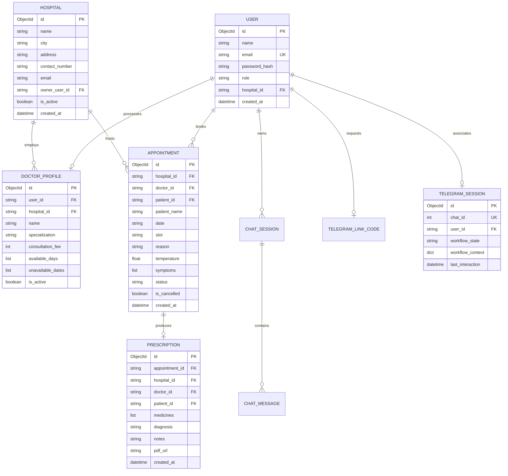

# CityCare Clinic — Architecture Specification

## 1. Executive Summary & Design Principles

CityCare Clinic is a production-grade multi-tenant healthcare consultation and clinic management platform. The system orchestrates end-to-end clinical workflows—from patient discovery and authenticated appointment scheduling to doctor consultations, clinical prescription generation, and automated patient follow-ups.

The architecture is built upon four fundamental engineering principles:

1. **Multi-Tenant Isolation**: Every operational entity (doctor, schedule, appointment, prescription) is scoped to a registered `Hospital` tenant. Cross-tenant access is strictly denied at both the route dependency level and the persistence layer via tenant-aware filters.
2. **Defensive Validation & Invariant Enforcement**: Critical invariants—such as 30-minute non-overlapping consultation slots, maximum 7-day advance booking windows, 1-patient-per-slot concurrency constraints, and valid physiological temperature ranges (95.0°F – 110.0°F)—are enforced deterministically before any database write occurs.
3. **Decoupled Omnichannel Client Layer**: The core business logic is encapsulated within reusable controllers and CRUD layers, serving four distinct client surfaces:
   - **Modern Web Application**: Single-Page / SSR frontend built with React 19, TypeScript, TanStack Start/Router, and TailwindCSS.
   - **Model Context Protocol (MCP) Server**: Standardized tool and resource interfaces allowing authorized AI agents to query availability and book appointments safely under patient authorization.
   - **Telegram Patient Gateway**: Natural language intake and guided scheduling interface with resilient session management, rate-limiting, and delivery tracking.
   - **Prescription CLI**: Terminal interface for healthcare staff consultations and clinical prescription generation.
4. **Resilient AI Orchestration with Fail-Safes**: LLM integrations (Google Gemini 3.6 Flash with 3.1 Flash-Lite fallback) execute with bounded timeouts, schema-enforced tool calling, and deterministic local fallbacks when external networks or AI providers are unavailable.

---

## 2. Directory Layout & Layer Responsibilities

The codebase enforces a unidirectional dependency hierarchy: `Routes → Controllers → CRUD / Persistence → Database Driver`.

```
CITYCARE_CLINIC/
├── backend/                         # Production Python FastAPI, AI assistants, and MCP server
│   ├── main.py                      # ASGI application factory, lifespan lifecycle, middleware, and health probes
│   ├── common/                      # Cross-cutting foundational utilities (auth, configuration, logging, tenant scoping)
│   │   ├── auth.py                  # JWT verification, password hashing, and role-based access dependencies
│   │   ├── config.py                # Environment variable parsing, validation gates, and CORS normalization
│   │   ├── logger.py                # Structured logging configuration with rotation-safe handlers
│   │   └── tenant_scope.py          # Tenant context extraction and cross-tenant boundary verification
│   ├── core/                        # Core hospital and clinic business domains
│   │   ├── apis/
│   │   │   ├── api.py               # Aggregated API router declaring OpenAPI v1 boundaries
│   │   │   ├── routes/              # HTTP route endpoints (admin, appointment, auth, doctor, hospital, prescription)
│   │   │   └── schemas/             # Pydantic v2 schemas for request validation and response serialization
│   │   ├── constants.py             # Centralized system constants, user roles, appointment statuses, and clinic slots
│   │   ├── controllers/             # Domain logic orchestration, validation gates, and transaction workflows
│   │   ├── cruds/                   # Low-level asynchronous MongoDB database operations via ODMantic
│   │   ├── database/                # Motor MongoDB connection management, index creation, and initial seeding
│   │   ├── models/                  # ODMantic Document models defining MongoDB collections and schemas
│   │   └── services/                # Cloudinary media uploads and ReportLab PDF prescription generation
│   ├── chatbot/                     # AI Schedule Assistant and clinical conversational engine
│   │   ├── controllers/             # Chat session lifecycle and message coordination
│   │   ├── cruds/                   # MongoDB persistence for chat sessions and message histories
│   │   ├── gemini_client.py         # Google GenAI SDK wrapper with multi-turn tool calling and model fallback
│   │   ├── models/                  # Chat session and message ODMantic document models
│   │   ├── prescription_assistant.py# Structured clinical extraction and drug interaction assistant
│   │   ├── rag_service.py           # ChromaDB vector store integration with patient handbook embeddings
│   │   ├── routes/                  # REST endpoints for interactive schedule and prescription chat
│   │   ├── schemas/                 # Validation schemas for conversational requests and tool invocations
│   │   └── tools.py                 # Execution engine for Gemini function calling tools
│   ├── telegram_bot/                # Telegram messaging gateway and stateful patient workflow engine
│   │   ├── client.py                # Asynchronous Telegram Bot API HTTP client
│   │   ├── conversation.py          # Natural language parsing, date extraction, and intent classification
│   │   ├── cruds.py                 # Telegram user session, update deduplication, and link code persistence
│   │   ├── gateway.py               # Central dispatcher, state machine transitions, and error handlers
│   │   ├── medical_assistant.py     # Conversational clinical intake with emergency escalation guards
│   │   ├── models.py                # Persistence models for Telegram sessions, updates, and one-time link codes
│   │   ├── patient_service.py       # Bridging service invoking core appointment and prescription operations
│   │   ├── polling.py               # Local-development long-polling runner
│   │   ├── routes.py                # Webhook endpoint receiving Telegram updates and one-time link code generation
│   │   └── schemas.py               # Pydantic models for incoming Telegram payloads
│   ├── mcp_server/                  # FastMCP server exposing clinic operations to AI agents
│   │   ├── server.py                # FastMCP app configuration, Streamable HTTP and stdio transport runners
│   │   └── tools/                   # MCP tools (appointments, doctor discovery, prescriptions) and auth bridge
│   ├── cli/                         # Command-line interface utilities
│   │   ├── commands/                # Interactive commands (e.g. terminal prescription consultation)
│   │   └── main.py                  # CLI entry point parsing command arguments
│   ├── data/                        # Static clinical reference documents and local ChromaDB stores
│   │   └── handbook/                # CityCare Clinic Patient Handbook PDF source
│   ├── tests/                       # Comprehensive test suite (unit, integration, security, and concurrency)
│   ├── pyproject.toml               # Python project configuration, ruff linter, and pytest settings
│   └── requirements.txt             # Production dependencies
├── frontend/                        # Production Single-Page / SSR web frontend
│   ├── src/                         # React components, routes, hooks, and API client layer
│   ├── public/                      # Static assets, icons, and robots.txt
│   ├── package.json                 # Node dependencies and build scripts
│   └── vite.config.ts               # Vite bundler and TanStack Start configuration
├── docs/                            # Production architectural specifications and operational runbooks
│   ├── ARCHITECTURE.md              # Authoritative system architecture document (this file)
│   └── runbooks/                    # Detailed operational runbooks (Telegram gateway, MCP, disaster recovery)
└── scripts/                         # Operational management scripts (webhook setup, migrations, document ingestion)
```

### Layer Responsibilities

- **Routes (`backend/core/apis/routes/`, `backend/chatbot/routes/`, `backend/telegram_bot/routes.py`)**: Accept HTTP/Webhook requests, validate input headers and schemas, authenticate credentials via dependencies, and delegate immediately to controllers.
- **Controllers (`backend/core/controllers/`, `backend/chatbot/controllers/`, `backend/telegram_bot/gateway.py`)**: Enforce business rules, verify domain invariants (e.g., slot collisions, temperature bounds), coordinate side-effects (e.g., PDF generation, Cloudinary sync), and assemble response structures.
- **CRUD & Persistence (`backend/core/cruds/`, `backend/chatbot/cruds/`, `backend/telegram_bot/cruds.py`)**: Perform atomic queries and mutations against MongoDB using ODMantic document models. Contain zero HTTP-specific logic.
- **Database (`backend/core/database/database.py`)**: Manages the life-cycle of the `AsyncIOMotorClient` and `AIOEngine`, connection pooling, health checks, and shutdown flushes.

---

## 3. Data Models & Entity Relationships



---

## 4. Concurrency Controls & Booking Invariants

### 1. Appointment Concurrency & Double-Booking Prevention
The appointment engine guarantees that no two patients can occupy the same doctor slot on the same calendar date:
- **Pre-flight Availability Verification**: When availability is queried via `GET /api/v1/hospitals/{h_id}/doctors/{d_id}/free-slots?date={YYYY-MM-DD}`, the controller loads the clinic master slot list (12 discrete slots) and subtracts all existing non-cancelled bookings.
- **Booking Gate Verification**: Upon receiving `POST /api/v1/book`, the system performs four synchronous validation gates:
  1. **Temporal Range Gate**: Date must fall strictly within `[today, today + 7 days]`. Past dates and dates beyond 7 days are rejected with HTTP 400.
  2. **Doctor Availability Gate**: Verifies the doctor is not on scheduled leave (`unavailable_dates`) and practices on the selected weekday.
  3. **Slot Menu Gate**: Slot must match one of the 12 fixed clinic slot strings.
  4. **Uniqueness Gate**: Executes a targeted query for any existing active (`is_cancelled == False`) appointment for that doctor, date, and slot. If found, HTTP 409 Conflict is returned immediately.
- **Atomic Insertion**: The appointment is written with a unique compound index on `(doctor_id, date, slot, is_cancelled)`.

### 2. Telegram Webhook Deduplication & Idempotency
- Incoming Telegram updates carry an integer `update_id`.
- The gateway records every processed `update_id` in a MongoDB TTL/idempotency collection before executing state transitions.
- Duplicate updates sent by Telegram during network retries return HTTP 200 immediately without re-executing booking or state mutations.

### 3. Patient Account Linking Security
- Existing web users can link their Telegram handle without transmitting plaintext passwords over chat.
- The web app generates a cryptographically random one-time link code (`TELEGRAM_LINK_CODE`) valid for exactly 10 minutes.
- When the user sends `/link <code>` in Telegram, the code is atomized, verified, consumed, and deleted.

---

## 5. Security Architecture & Threat Boundaries

### 1. Authentication & JWT Tokens
- User authentication uses JSON Web Tokens signed with HMAC-SHA256 (`HS256`, configurable to `HS384` or `HS512`).
- Production mode enforces a minimum secret length of 32 characters and strictly forbids default development secrets.
- Passwords are salted and hashed using Bcrypt with a high work factor.

### 2. Role-Based Access Control (RBAC)
- Four discrete roles exist with clear privilege boundaries:
  - `super_admin`: Cross-tenant platform administration, hospital onboarding, and hospital owner provisioning.
  - `hospital_owner`: Administrative authority over their specific hospital tenant, doctor staff rosters, and facility records.
  - `doctor`: Access to their own daily consultation roster, patient medical histories, and prescription generation.
  - `patient`: Access restricted strictly to their own appointments, personal prescriptions, and available doctor discovery.

### 3. Cross-Tenant Isolation Enforcement
- Every query executing within hospital-scoped endpoints validates that the requesting user's `hospital_id` claim matches the requested entity's tenant identifier.
- Attempting to query, mutate, or book resources under a mismatched tenant ID results in an immediate HTTP 403 Forbidden.

### 4. Input Sanitization & Content Security
- CORS headers are strictly checked: in production, wildcard `*` origins with credentials are prohibited, and all origins must enforce the `https://` protocol.
- Sensitive credentials (JWT secrets, Telegram tokens, Cloudinary API secrets, Gemini keys) are isolated to server-side environment variables and strictly excluded from client-side bundles.
